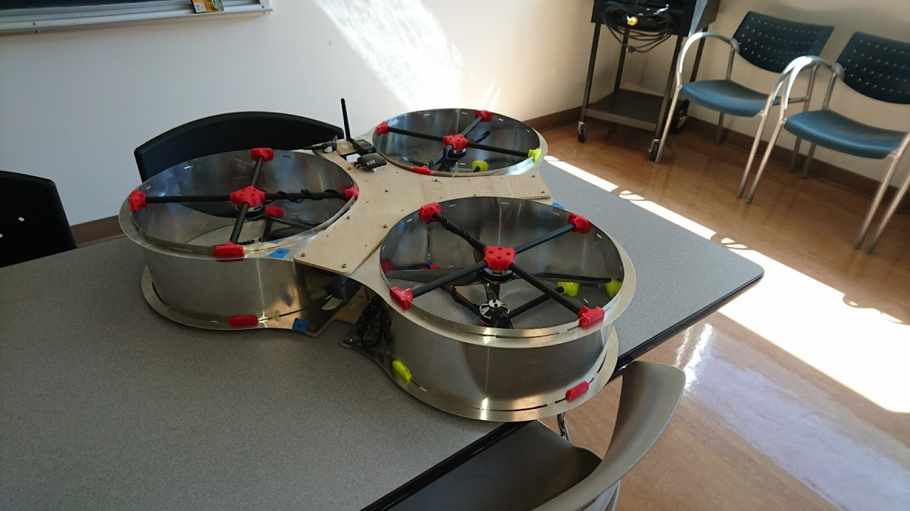
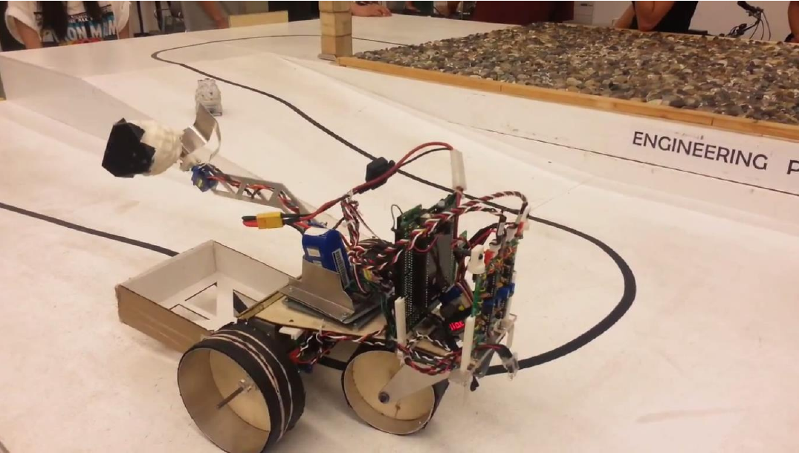

# Project Portfolio

## Location-tracking Clock

In the fall of 2019, I modified a traditional mantel clock with the ability to show the locations of members of my family, as seen below.

This showcased my flexibily, as I was required to involve many different aspects of engineering, from the mechanical aspect of designing a mechanism which could drive five hands independently of each other, to the electrical aspect of connecting motors, to the software side, where I utilized a Raspberry Pi in conjunction with smartphone apps to detect users' locations.

The internal mechanics heavily utilize 3D printed parts, mainly for their versitility and low cost. The custom mechanism I designed can be seen below; the five hand tiered design is clearly visible.

## Hallway-Navigating Roomba

In Fall 2017, as a project for a robotics course, I worked with two others on modifying a Roomba iCreate development platform to navigate its way down a hallway, using only a camera and onboard image-processing software. 

To do this, we utilized a Raspberry Pi 2 running Python code to analyse an image of the hallway ahead of it, pick out the lines formed by the intersection of the hallway and the walls, then find the vanishing point of the hallway. From this, the robot could navigate itself down the hallway without a need for bump sensors and other methods of navigation. 

A video of it in action is shown below. The robot is running entirely off of the Raspberry Pi; the laptop shown is solely providing power to the setup..

<video width="650" height="366" controls preload> 
    <source src="roomba.webm"></source> 
</video>

<!--Additional navigation methods were planned for the robot, such as determining when it arrived at a corner, and mapping capabilities to allow it to find its way back 'home', but our team ran out of time in the semester to implement them all.-->

<!--We were inspired by a project from the Universidad del Valle, Cali, Colombia, in which they utilize a similar algorithm to detect the lines of the hallway and compute the logical way forward.

<iframe width="650" height="480" src="https://www.youtube.com/embed/NC7mKUrJOE0" frameborder="0" allow="accelerometer; autoplay; encrypted-media; gyroscope; picture-in-picture" allowfullscreen></iframe>-->

## Drone-based Terrain Model Generation and Elevation Mapping

As a project for 3vGeomatics in Fall 2016, I was a part of a three-man group working to find a better method of producing elevation data of sites for geographic applications. We decided to utilize footage from a drone flyover to generate a 3D model of the area using photogrammetry.

Our initial test run of the software utilized six screenshots from Google Maps' 3D terrain feature, and produced excellent results, as seen below.

<iframe width="650" height="480" src="https://sketchfab.com/models/684fe805ccb546b6ad01d56f9e56f2e2/embed?camera=0" frameborder="0" allow="autoplay; fullscreen; vr" mozallowfullscreen="true" webkitallowfullscreen="true"></iframe>

As can be seen, the software we utilized accurately captured the terrain and buildings in the test area. After more research and development was done, we were able to utilize a drone to take images of a cliff face near UBC, as seen below.

The footage from this run allowed us to make a 3D map of the region.

Lastly, this model allowed us to produce a Digital Elevation Model of the terrain, usable for geomatics work.

This process proved to be much more accurate, flexible, and cheaper than relying on public domain elevation data or aircraft mapping runs. 3vGeomatics was very happy with our results and intended to use this process regularly in the future.

## Wire-following/Musical Robot

In Spring 2015, I was part of a group project to build and program a robot capable of following a wire. It accomplished this task by carrying several inductors on its underside, allowing it to sense the magnetic field coming off of the wire. The robot was powered by a custom microcontroller running C code, of which I helped contribute to, enabling our robot to be one of the fastest in the class, as seen below in its line-following.

<video width="650" height="366" controls preload> 
    <source src="pre-jitterbug.webm"></source> 
</video>

In Summer 2017, as part of a personal project, I repurposed the chassis of the robot project into a more entertaining role, by implementing a piezo buzzer into its electronics, rewiring the robot to work off an Arduino, and writing additional code to allow the robot to 'sing' part of the song 'Wake Me Up Before You Go-Go', while moving to the beat. Precise timing control was required to allow the single instruction processing queue of the processor to allow for both sets of actions to occur. A video of the finalised product is below.

<video width="650" height="366" controls preload> 
    <source src="jitterbug.webm"></source> 
</video>

## Weatherproof Search and Rescue UAV

In Spring 2016, I worked with two other students as part of our ENPH 459 capstone project to design and construct an Unmanned Aerial Vehicle on behalf of InDro Robotics. They requested we create a vehicle which was capable of operating in situations of high rain and wind, in order to suppliment their search-and-rescue operations.

I performed extensive research on the design of the UAV's propulsion system, and concluded that a ducted fan setup would be most efficient. Limitations in the resources available to us meant modifications to the design were required, but the general idea of a ducted system was retained for both safety and a slight boost to performance.

Below is an image of the chassis of the UAV, prior to installing the primary command and control hardware. One can see the doubled-up triple propellor setup, as well as all six motor controllers.

Here is the completed UAV. We opted for rapid prototyping techniques, so that we could focus primarily on the design, rather than get tied up in the fabrication process. My main contribution to this design was the propellor attachment system. I modelled the 3D-printed components, and utilized carbon fibre rods for a light, yet sturdy connection.

A video of one of the early flight tests is shown below. Results from these test flights showed that more thrust was required, and we thus endeavoured to acquire a more powerful battery for future tests.

<video width="650" height="366" controls preload> 
    <source src="drone.webm"></source> 
</video>

## Autonomous Artifact-Collecting Robot

During Summer of 2014, I worked with a team of three others to design and construct a robot from scratch. It had to be capable of detecting and collecting several artifacts, all while navigating an obstacle course. I focused primarily on the design of the chassis and mechanical grabber, and was instrumental in making the robot the lightest and fastest in the class.

I primarily used Solidworks to design the various parts, and then utilized a laser cutter, waterjet cutter, and 3D printer to rapidly prototype the parts. We went through several iterations of the design, but ultimately wound up with a design which completed its objective extremely quickly.

A video of the design, construction, testing, and presentation of the robot, made by fellow group member Zachary Morris is shown below.

<iframe width="650" height="366" src="https://www.youtube-nocookie.com/embed/5J3dVUOgQlc" frameborder="0" allow="accelerometer; autoplay; encrypted-media; gyroscope; picture-in-picture" allowfullscreen></iframe>